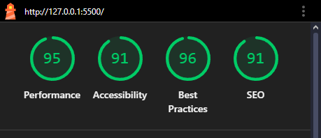

# 🧬 Projeto: Rick & Morty UI

Este projeto utiliza a [API do Rick & Morty](https://rickandmortyapi.com) para realizar buscas dos personagens da série **Rick & Morty**.  

Ele foi desenvolvido como um teste prático de **Frontend Angular**, explorando todo o processo de desenvolvimento, desde a criação do projeto aos testes unitários.

---

## 📘 Estrutura do Projeto

```

📂 victor-rickmorty-ui/
├── 📁 public                               ← Notebook principal
├── 📁 src/                                 ← Pasta raiz do projeto (Source)
    ├── 📁 app/                             ← Pasta princípal do projeto (Application)
        ├── 📁 layout/                      ← Layout geral da aplicação (Templates)
        ├── 📁 pages/                       ← Páginas do site
        ├── 📁 shared/                      ← Módulo compartilhado entre todas as páginas
            ├── 📁 models/                  ← Entidades utilizadas por todo o sistema
            ├── 📁 services/                ← Serviços de requisição HTTP e LocalStorage
    ├── 📁 environments/                    ← Variáveis de Ambiente
├── 📄 README.md                            ← Este arquivo de documentação

````

---

## ⚙️ Objetivo

Criar uma aplicação Angular para consumir e manipular os
dados da API pública escolhida, a versão do angular deve ser
superior a versão 17 e o design system ou biblioteca de componentes fica
a sua escolha. A aplicação deverá permitir a listagem, visualização,
criação, edição e exclusão.

---

## 🧩 Tecnologias Utilizadas

- **Angular 19** → Framework Frontend
- **Jest** → Testes unitários
- **Sweet Alert 2** → Exibição de Alertas personalizados
- **Material Design** → Biblioteca de componentes

---

## ✨ LightHouse (SEO)



---

## 📦 Instalação e Configuração do Ambiente

### 1️⃣ Clone o projeto na sua máquina e baixe as dependências:
```bash
# Clonar
git clone https://github.com/vek03/victor-rickmorty-ui.git

# Entrar na pasta clonada
cd victor-rickmorty-ui

# Instalar as dependências do Node.js
npm install
````

### 2️⃣ Rode o projeto

```bash
npm run start
```

Abra o navegador no [Localhost](http://localhost:4200).

---

## 💡 Observações Importantes

* O projeto é **não possui backend próprio** (todos os dados são coletados de APIs públicas, e não há credenciais).

---

## ✍️ Autores

**Projeto desenvolvido por:**

<div align="center">

| [<br><sub>Victor Cardoso</sub>](https://github.com/vek03)
| :---: |

</div>

---
